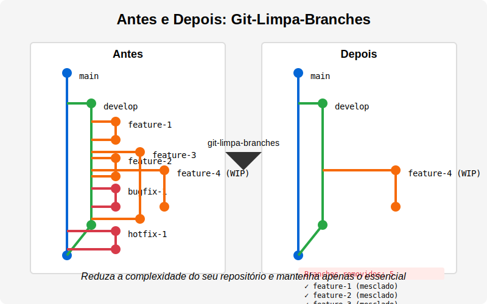

# Git-Limpa-Branches

Utilitário para limpeza segura de branches Git. Identifica e remove automaticamente branches que já foram mesclados aos ramos principais, preservando branches protegidos e solicitando confirmação do usuário para cada operação.

## 🔍 O Problema

Com o tempo, repositórios Git acumulam dezenas ou até centenas de branches obsoletos que já foram mesclados aos ramos principais. Isso dificulta a navegação, aumenta o tamanho do repositório e torna mais complexo o gerenciamento de branches ativos.

## 📊 Antes e Depois



O diagrama acima mostra como Git-Limpa-Branches simplifica seu repositório, removendo branches mesclados e mantendo apenas branches ainda em desenvolvimento e os branches protegidos.

## 🚀 A Solução

Git-Limpa-Branches analisa automaticamente seu repositório para:

- ✅ Identificar branches que foram completamente mesclados aos ramos principais
- ✅ Preservar branches importantes (main, master, develop)
- ✅ Detectar e manter branches que contêm alterações não mescladas
- ✅ Solicitar confirmação antes de executar qualquer operação
- ✅ Limpar tanto branches locais quanto remotos

## 📦 Instalação e Uso

### Uso Rápido com npx

```bash
# Execute diretamente via npx (sem instalação)
npx git-limpa-branches
```

### Instalação Global

```bash
# Instale globalmente
npm install -g git-limpa-branches

# Execute em qualquer repositório Git
git-limpa-branches
```

### Instalação Local

```bash
# Instale localmente em seu projeto
npm install git-limpa-branches --save-dev

# Execute via npx
npx git-limpa-branches
```

## 💻 Desenvolvimento

Para desenvolver e contribuir com o projeto:

```bash
# Clone o repositório
git clone https://github.com/seu-usuario/git-limpa-branches.git

# Entre no diretório
cd git-limpa-branches

# Instale as dependências
pnpm install

# Compile o TypeScript em modo de observação
pnpm dev

# Execute testes
pnpm test

# Execute testes em modo de observação
pnpm test:watch

# Compile para produção
pnpm build

# Execute localmente
pnpm start
```

### Estrutura do Projeto

```
git-limpa-branches/
├── dist/               # Código compilado
├── src/                # Código fonte
│   ├── git-limpa-branches.ts     # Arquivo principal
│   └── git-limpa-branches.test.ts # Testes
├── docs/               # Documentação e imagens
├── package.json        # Configuração do pacote
└── tsconfig.json       # Configuração do TypeScript
```

O script irá:

1. Atualizar a lista de branches remotos (com sua confirmação)
2. Analisar cada branch para determinar se pode ser excluído com segurança
3. Apresentar um resumo claro dos branches que podem ser removidos
4. Solicitar confirmação para cada operação de exclusão

## 🔒 Branches Protegidos

Por padrão, os seguintes branches nunca serão excluídos:

- main
- master
- develop

## 🧪 Testes

```bash
# Execute os testes unitários
npm test
```

## ⚙️ Personalização

Para adicionar ou remover branches protegidos, edite a constante `BRANCHES_PROTEGIDOS` no arquivo `git-limpa-branches.js`:

```javascript
// Branches protegidos
const BRANCHES_PROTEGIDOS = ['main', 'master', 'develop', 'homologacao'];
```

## 📋 Requisitos

- Node.js instalado
- Git instalado e configurado no sistema
- Permissões para excluir branches remotos (se desejar usar essa funcionalidade)

## 🛡️ Segurança

Este utilitário foi projetado com segurança em mente:

- Nunca exclui branches protegidos
- Preserva branches com alterações não mescladas
- Solicita confirmação explícita antes de cada ação
- Pode ser interrompido a qualquer momento
- Mostra claramente o que está prestes a ser feito

## 🤝 Contribuição

Contribuições são bem-vindas! Sinta-se à vontade para:

1. Abrir issues relatando bugs ou sugerindo melhorias
2. Enviar pull requests com correções ou novas funcionalidades
3. Melhorar a documentação

## 📝 Licença

MIT